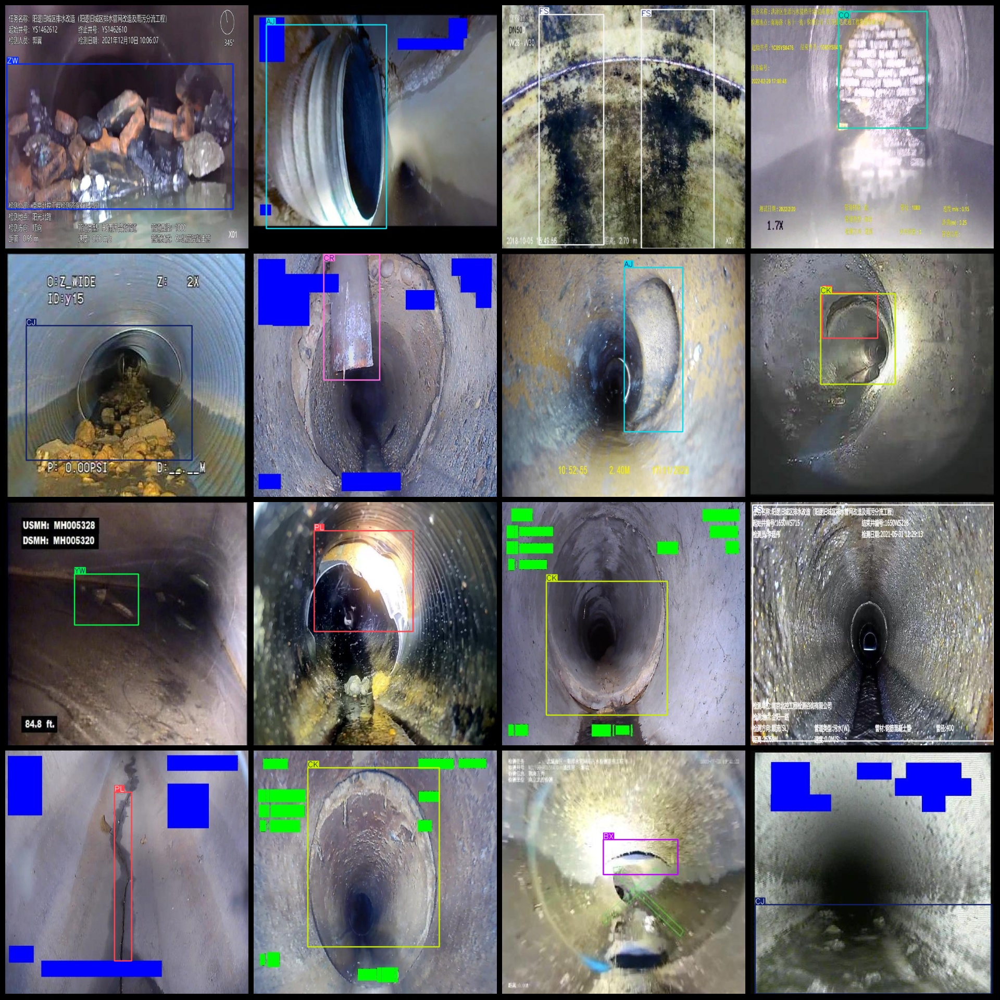
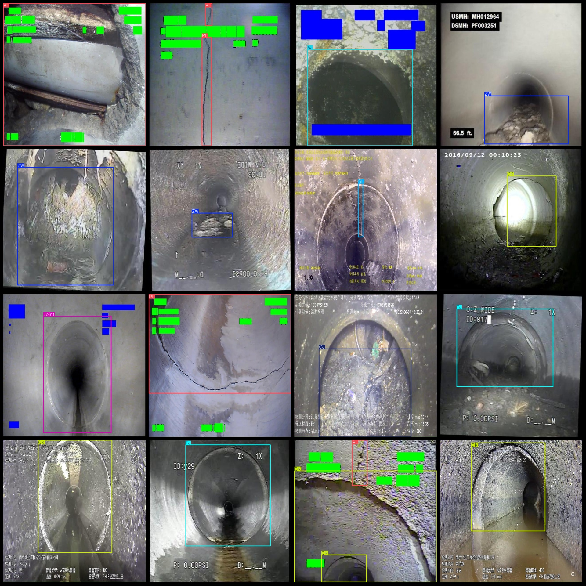

# Data Set of Inspection for Drainage Pipelines and Drainpipes Including Defects, Injuries, Foreign Objects, Corrosion, etc. in VOC+YOLO Format with 24318 Images and 17 Categories

Dataset format: Pascal VOC format + YOLO format (txt file without split path, only including jpg images and corresponding VOC format xml files and yolo format txt files)
Number of images (jpg file count): 24318
Number of annotations (xml file count): 24318
Number of annotations (txt file count): 24318
Number of annotation categories: 17
Annotation category names (note that the order in the yolo format is not consistent with this, but refer to the labels folder's classes.txt): ["AJ", "BX", "CJ", "CK", "CQ", "CR", "FS", "JG", "Joint", "PL", "QF", "SG", "SL", "TJ", "TL", "YW", "ZW"]
Each category has a number of bounding boxes:
AJ (dripout) bounding box count = 2022
BX (deformation) bounding box count = 1726
CJ (deposition) bounding box count = 3789
CK (misalignment) bounding box count = 2274
CQ (cracked wall root) bounding box count = 181
CR (foreign object penetration) bounding box count = 1186
FS (corrosion) bounding box count = 984
JG (scale formation) bounding box count = 326
Joint (pipe interface) box count = 1000
PL(Break) box count = 9313  
QF(Rise and Fall) box count = 188  
SG(Root) box count = 1711
SL (Leakage) Frames = 693
The number of TJ (disconnect) boxes is 1453.
TL (Interface material loss) box count = 668  
YW (Foreign object) box count = 278
The number of ZW (obstacle) boxes = 3299
Total frame count: 31091
images per class:   
AJ(branched junction) images = 1885
BX (transform) has 1498 images.
CJ (sedimentation) has a picture count = 3775
CK(Crooked) images = 2200
CQ(Crumbling Wall Base) images = 181
CR (Clothing Remnants) occupancy = 1032
FS(corrosion) images = 881  
JG(scale-up) images = 257  
Joint(pipe joint) images = 1000  
PL(fracture) images = 6859
The number of QF (Swing) pictures is 188.
SG (stumps) hold image count = 1292
SL (Leak) images = 665
TJ (disconnection) has 1443 images.
TL (Total Length) = 624
YW (Foreign Object) occupies image count = 231
The number of ZW images is 2955.
image resolution: 640x640  
Use annotation tool: labelImg
Annotation rules: draw a rectangle around the class.
Important note: The dataset does not have split into training, validation, and test sets.
Special Notice: This dataset does not guarantee the accuracy of the trained model or weight files.
Image Preview:
## Images

Here is a pay link on Stripe ( https://buy.stripe.com/3cs8yP7sY87d0vu9AB ). Please contact me lonlonago@foxmail.com after funding $89, and I will send you a complete data files , thank you!

